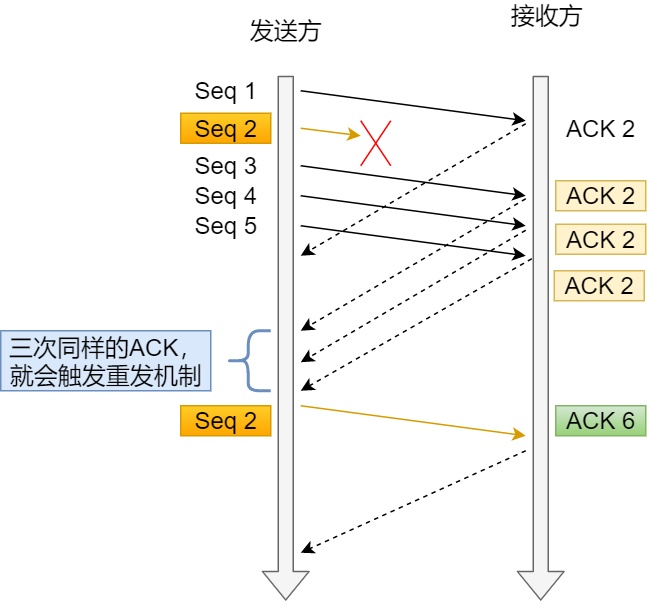

- MAC首部 14
    - 目标mac地址 6
    - 源mac地址 6
    - 以太网类型

- IP首部 20

    - 首部长度 
    - 版本 
    - 服务类型

    - 总长度
    - 标志
    - 分片偏移
    - 生存时间
    - 协议
    - 校验和
    - 源ip
    - 目标ip

- TCP首部 20

    - 源端口
    - 目标端口
    - 序列号
    - 确认号
    - 保留6位中的4位首部长度
    - tcp首部长度
    - 6位标志位 SYN, FIN, ACK, PSH, RST, URG
    - 保留6位中的2位
    - 16位窗口大小
    - 16位校验和
    - 16位紧急指针

> tcp四次挥手为什么要等待2MSL

　　1、防止客户端最后一次发给服务器的确认在网络中丢失以至于客户端关闭，而服务端并未关闭，导致资源的浪费。

　　2、等待最大的2msl可以让本次连接的所有的网络包在链路上消失，以防造成不必要的干扰。

　　如果client直接closed，然后又向server发起了一个新连接，我们不能保证这个新连接和刚关闭的连接的端口号是不同的。假设新连接和已经关闭的老端口号是一样的，如果前一次滞留的某些数据仍然在网络中，这些延迟数据会在新连接建立后到达Server，所以socket就认为那个延迟的数据是属于新连接的，数据包就会发生混淆。所以client要在TIME_WAIT状态等待2倍的MSL，这样保证本次连接的所有数据都从网络中消失。

## 重传机制

- 基本概念
    - 应答机制: A给B发送序列1到1000的包,B收到后应答下一个是1001
- 超时重传
    - 重传时间RTO (RTT 往返时间)太短可能应答还没有到就重传了,太长传输慢
    - RTO应该略大于RTT,并且跟随RTT动态变化,经验公式
- 快速重传
    - 通过发送的数据表和返回的应答确定丢失的数据表
    - 
- SACK 方法(Selective Acknowledgment 选择性确认)
    - 在TCP头部字段里增加SACK,用于保存已经收到的数据包
    - 
- D-SACK 重复的SACK
    - 通过SACK告诉发送方哪个包重复了

## 滑动窗口

- 通过窗口大小控制发送包的数量

## 流量控制

- 动态调整窗口大小,窗口大小和操作系统缓冲区有关,动态变化

## 拥塞控制

流量控制是为了防止接收方缓存占满

拥塞控制是为了防止网络出现拥堵

当网络已经拥堵时,如果继续发送大量的数据包,就会导致数据包延迟,丢失等,此时tcp就会重传数据,重传又会加剧网络拥堵,导致更大的延迟和丢包.所以有了拥塞控制

发送窗口swnd,接收窗口rwnd,拥塞窗口cwnd 关系swnd=min(cwnd, rwnd)

当网络发送拥塞,减小拥塞窗口

- 算法

    - 慢启动

        - 建立连接后不要一上来就发送大量数据,拥塞窗口指数增大,cwnd< ssthresh

    - 拥塞避免算法

        - 当cwnd>=ssthrsh后,开始使用拥塞避免算法,线性增加cwnd.

    - 拥塞发生

        > 当网络发生拥塞,丢包后,重传机制有两种:超时重传,快速重传

        - 当发生超时重传sshresh = cwnd / 2 , cwnd = 1
        - 当发生快速重传 cwnd = cwnd / 2, sshthresh = cwnd

    - 快速恢复

        - +3