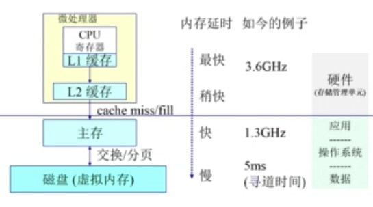
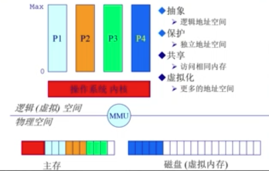
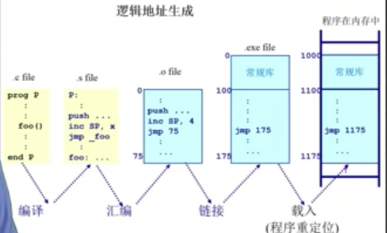
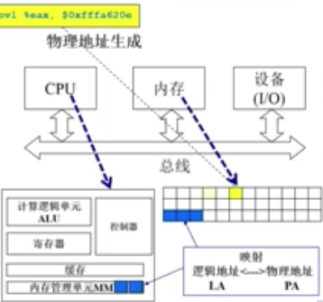
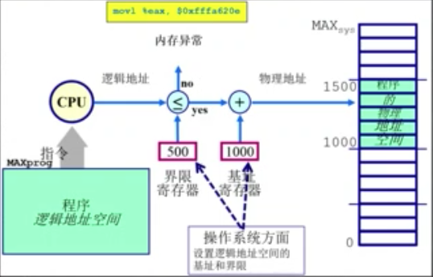

# 内存

## 计算机体系结构 / 内存分层体系

- 计算机体系结构
    - CPU 包括运算器、控制器、寄存器、缓存cache、存储管理单元MMU
    - 内存 物理内存
    - 设备（I/O）磁盘，网卡等
    - 通过总线连接
- 内存
    - 
    - 
    - 内存管理的目的
        - 抽象 逻辑地址空间
        - 保护 独立地址空间
        - 共享 访问相同内存
        - 虚拟化 更多的地址空间
    - 内存管理方法
        - 程序重定位
        - 分段
        - 分页
        - 虚拟内存
        - 按需分页虚拟内存
    - 实现高度依赖于硬件
        - 内存架构
        - MMU（内存管理单元）：硬件组件负责处理CPU的内存访问请求

## 地址空间 & 地址生成

- 地址空间定义
    - 物理地址空间 - 硬件支持的地址空间
        - 起始地址 0 到 **MAX**__sys__
    - 逻辑地址空间 - 一个运行的程序所拥有的内存范围
        - 起始地址 0 到 **MAX**__prog__
    - 
    - 
- 地址生成
    - 
    - CPU方面
        1. 运算器需要在逻辑地址的内存中的内容
        2. 内存管理单元寻找在逻辑地址空间和物理地址空间的映射关系
        3. 控制器从总线发送在物理地址的内存内容的请求
    - 内存方面
        4. 内存发送物理地址内存的内容给CPU
    - 操作系统方面
        - 建立逻辑地址和物理地址之间的映射
    - 

    - 地址安全检查（保护） 
        - CPU只知道程序要访问的逻辑地址空间
        - 操作系统设定逻辑地址空间的界限，该界限对应的物理地址空间是可以访问的
        - 

##  连续内存分配

- 在操作系统的内存管理
    - 简单的内存管理的方法
        - 当一个程序准许运行在内存中时，分配一个连续的区间
        - 分配一个连续的内存区间给运行的程序以访问数据
- 内存碎片 空闲内存不能被利用
    - 碎片分类
        - 外部碎片 在分配单元间的未使用的内存
        - 内部碎片 在分配单元中的未使用的内存
    - 内存分区动态分配策略
        - 首次适配 直接分配第一个够用的内存块
        - 最优适配
        - 最差适配
    - 碎片整理
        - 压缩式碎片整理 移除空闲块
        - 交换式碎片整理 内存不够用的时候把没用的移出去，比如到硬盘

- 连续内存分配的缺点
    - 分配给一个程序的物理内存是连续的
    - 内存利用率较低
    - 有内碎片、外碎片的问题

## 非连续内存分配

- 为什么需要非连续内存分配
    - 分段 Segmentation
    - 分页 Paging
    - 页表 Page Table
- 非连续内存分配的优点
    - 一个程序的物理地址空间是非连续的
    - 更好的内存利用和管理
    - 允许共享代码和数据等（共享库等）
    - 支持动态加载和动态链接
- 非连续内存分配的缺点
    - 如何建立虚拟地址和物理地址之间的转换
        - 软件方案
        - 硬件方案
            - 分段
                - 程序的分段地址空间
                - 分段寻址方案
            - 分页

