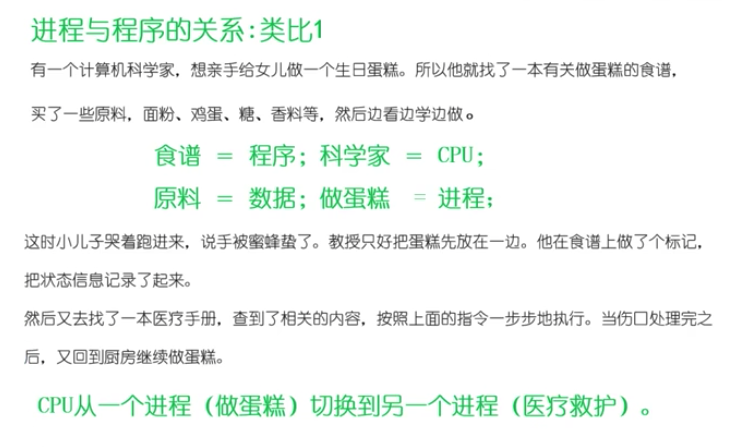
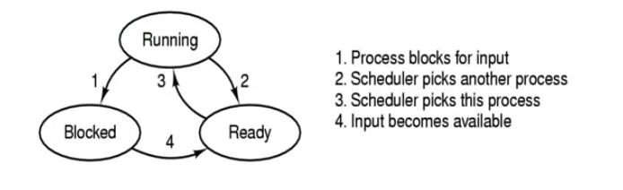
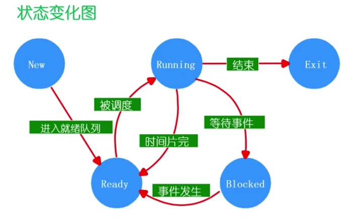
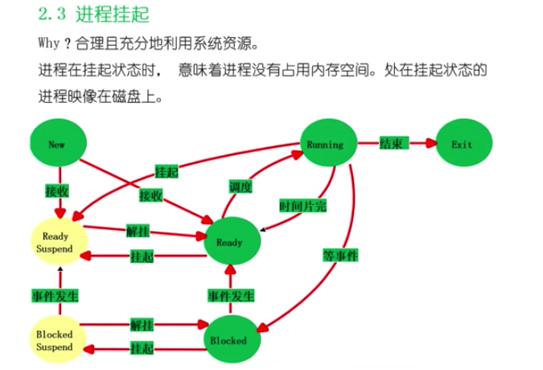
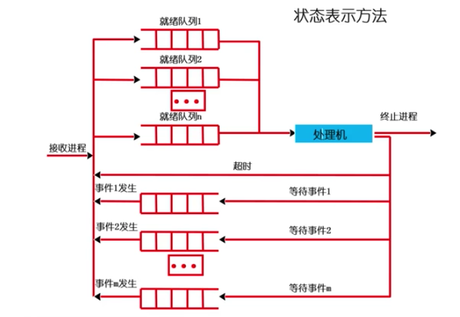
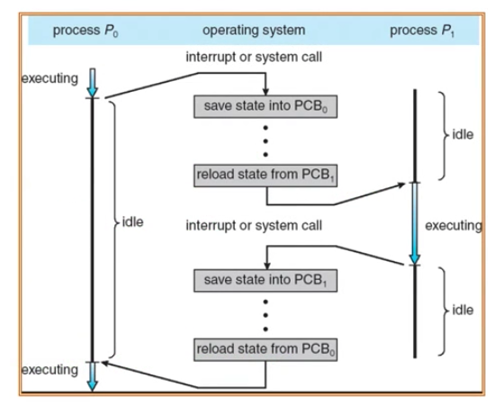
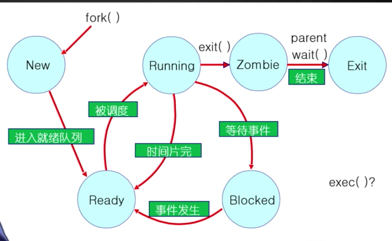

# 进程

### 进程的描述

- 定义：一个具有一定独立功能的**程序**在一个**数据**集合上的一次动态**执行过程**
  
- 消耗计算机资源 cpu 内存 网络
  
- 组成

    - 代码
    - 处理的数据
    - 程序计数器中的值，指示下一条将运行的指令
    - 一组通用的寄存器的当前值，堆、栈
    - 一组系统资源（如打开的文件）
    - 总之 进程包含了正在运行的一个程序的所有状态信息。
    
- 进程的特点

    - 动态性：可动态地创建、结束进程
    - 并发性：进程可以被独立的调度并占用处理机运行；并发运行
    - 独立性：不同的进程的工作互不影响，其他进程不会破坏本进程的运行。不同进程不同页表
    - 制约性：因访问共享数据、资源或进程间同步而产生制约

    

###进程和程序

- 进程和程序的关系
    - 程序是产生进程的基础
    - 程序的每次运行构成不同的进程
    - 进程是程序功能的体现
    - 通过多次执行，一个程序可以对应多个进程；通过调用关系，一个进程可包括多个程序。
- 进程和程序的区别
    - 进程是动态的，程序是静态的：程序是有序代码的集合；进程是程序的执行，进程有核心态、用户态，进入系统调用比如操作硬盘
    - 进程是暂时的，程序是永久的：进程是一个状态变化的过程，程序可长久保存
- 进程和程序的组成不同：进程的组成包括程序、数据和进程控制块（进程状态信息）

> 一个类比

### 进程的静态管理 - 控制结构

- 描述进程的数据结构：进程控制块Process Control Block / PCB
    - 操作系统为每个进程都维护一个PCB，用来保存与该进程有关的各种状态信息。
    - 进程控制块：操作系统管理控制进程运行所用的集合信息。操作系统用PCB类描述进程的基本情况以及运行变化的过程，PCB是进程存在的唯一标志。
    - 使用进程控制块进行
        - 进程的创建：为该进程生成一个PCB
        - 进程的终止：回收PCB
        - 进程的组织管理：通过对PCB的组织管理来实现；
    - PCB包含的三大类信息
        1. 进程标识信息：如本进程的标识，本进程的产生者标识（父进程标识）；用户标识
        2. 处理机状态信息保存区：保存进程的运行现场信息
            1. 用于可见的寄存器：用户程序可以使用的数据，地址等寄存器
            2. 控制和状态寄存器：如程序计数器（PC），程序状态字（PSW）
            3. 栈指针：过程调用/系统调用/中断处理和返回时需要用到。
        3. 进程控制信息
            1. 调度和状态信息：用于操作系统调度进程并占用处理机使用
            2. 进程间通信信息：为支持进程间与通信相关的各种标识，信号，信件等，这些信息存在接收方的进程控制块中。
            3. 存储管理信息：包含有指向本进程映像存储空间的数据结构。
            4. 进程所用资源：说明由进程打开、使用的系统资源，如打开的文件等。
            5. 有关数据结构连接信息：进程可以连接到一个进程队列中，或者连接到相关的其他进程的PCB。
    - PCB的组织方式
        - 链表：同一状态的进程其PCB成一链表，多个状态对应多个不同的链表。各状态的进程形成不同链表：就绪链表、阻塞链表。链表便于插入和删除
        - 索引表：同一状态的进程归到一个index表（由index指向PCB），多个状态对应多个不同的index表。各状态的进程形成不同的索引表：就绪索引表，阻塞索引表。
    
    
    
    

### 进程动态管理 - 进程状态

- 进程的生命期管理

    - 进程创建
        - 引起进程创建的三个主要事件
            1. 系统初始化
            2. 用户请求创建一个新进程
            3. 正在运行的进程执行了创建进程的系统调用
    - 进程运行
        - 内核选择一个就绪的进程，让它占用处理机并执行 调度算法
            - 为何选择？
            - 如何选择？
    - 进程等待
        - 以下情况下，进程等待（阻塞）
            1. 请求并等待系统服务，无法马上完成
            2. 启动某种操作，无法马上完成
            3. 需要的数据没有到达
        - 进程只能自己阻塞自己，因为只有进程自身才能知道何时需要等待某种事件的发生。
    - 进程唤醒
        - 唤醒进程的原因：
            1. 被阻塞进程需要的资源可被满足
            2. 被阻塞进程等待的事件到达
            3. 将该进程的PCB插入到就绪队列
        - 进程只能被别的进程或者操作系统唤醒
    - 进程结束
        - 进程结束的情况
            - 正常 （自愿的）
            - 错误退出 （自愿的）
            - 致命错误 （强制的）
            - 被其他进程所杀（强制的）

- 进程的状态变化模型

    - 进程的三种基本状态：进程在生命结束前处于且仅处于三种基本状态之一，不同系统设置的进程状态数目不同。

        - 运行状态（Running）：当一个进程正在处理机上运行时。
        - 就绪状态（Ready）：一个进程获得了除处理机之外的一切所需资源，一旦得到处理机即可运行
        - 等待状态（又称阻塞状态 Blocked）：一个进程正在等待某一事件而暂停运行时。如等待某资源，等待输入输出完成。

    		

    - 进程运行的其他基本状态

        - 创建状态（New）：一个进程正在被创建，还没被转到就绪状态之前的状态
        - 结束状态（Exit）：一个进程正在从系统消失时的状态，这是因为进程结束或由于其他原因所导致的。

        

        

    - 状态变化

        - Null -> New：一个新的进程被产生出来执行一个程序
        - New -> Ready：当进程被创建完成并初始化后，一切就绪准备运行时，变为就绪状态，很块，分配PCB
        - Ready -> Running：处于就绪状态的进程被进程调度程序选中后，就分配到处理机上来运行
        - Running -> Exit：当进程表示它已经完成或者因出错，当前运行进程会有操作系统作结束处理
        - Running -> Ready：处于运行状态的进程在其运行过程中，由于分配给他的处理机的时间片用完而让出处理机。由操作系统完成
        - Running -> Blocked：当前进程请求某样东西且必须等待时，进入阻塞态，IO
        - Blocked -> Ready：当进程要等待某事件到来时，它从阻塞状态变到就绪状态。由操作系统控制

- 进程挂起模型

    - 目的：合理充分的利用系统资源
    - 进程在挂起状态是，意味着进程没有占用内存空间。处在挂起状态的进程映像在磁盘上。
- 
  
- 挂起状态
        - 阻塞挂起状态（Block-suspend）：进程在外存等待某事件的出现
        - 就绪挂起状态（Ready-suspend）：进程在外存，但只要进入内存，即可运行；
    - 挂起（Suspend）：把一个进程从内存转到外存；可能的情况：
        - 阻塞到阻塞挂起：没有进程处于就绪状态或就绪进程要求更多的内存资源是，会进行这种转换，以提交新进程或运行就绪进程；
        - 就绪到阻塞挂起：当有高优先级阻塞（系统认为会很快就绪的）进程和低优先级就绪进程是，系统会选择挂起低优先级就绪进程；
        - 运行到就绪挂起：对抢占式分时系统，当有高优先级阻塞挂起进程因事件出现而进入就绪挂起时，系统可能会把运行进程转到就绪挂起状态。
    - 在外存时的状态转换：
        - 阻塞挂起到就绪挂起：当有阻塞挂起进程因事件出现时，系统会吧阻塞挂起进程转换为就绪挂起进程。
    - 与挂起相关的状态转换：解挂/激活（Activate）：把一个进程从外存转到内存；可能有以下几种情况
        - 就绪挂起到就绪：没有就绪进程或挂起就绪进程优先级高于就绪进程时，会进行这种转换。
        - 阻塞挂起到阻塞：当一个进程释放足够内存是，系统会把一个高优先级阻塞挂起（系统认为会很快出现所等待的事件）进程转换为阻塞进程。
    
- 进程管理的方法状态队列

    - 有操作系统来维护一组队列，用来表示系统当中所有进程的当前状态；
    - 不同的状态分别用不同的队列来表示（就绪队列、各种类型的阻塞队列）；
    - 每个进程的PCB都根据它的状态加入到相应的队列中，当一个进程的状态发生变化时，它的PCB从一个状态队列中脱离出来，加入到另一个队列。
- 

### 进程管理

- 进程上下文切换

    - 停止当前运行的进程（从运行状态改变成其他状态）并且调度其他进程（转变成运行状态）
        - 必须在切换之前存储许多部分的进程上下文
        - 必须能够在之后恢复他们，所以进程不能显示它曾经被暂停过
        - 必须快速（上下文切换是非常频繁的）
    - 需要存储什么上下文
        - 寄存器（PC，SP，...），CPU状态，…
        - 一些时候可能会费时，所以我们应该尽可能避免

    - 

    - 操作系统为活跃进程准备了进程控制块
    - 操作系统将进程控制块放置在一个合适的队列里
        - 就绪队列
        - 等待I/O队列（每个设备的队列）
        - 僵尸队列？

- 进程控制

    - exec
        - exec（）调用允许进程“加载”一个不同的程序并且在main开始执行（事实上_start）
        - 它允许一个进程指定参数的数量(argc)和它的字符串参数数组(argv)
        - 如果调用成功
            - 它是相同的进程
            - 但是它运行了一个不同的程序
        - 代码，stack，heap重写
    - fork()的简单实现
        - 对子进程分配内存
        - 复制父进程的内存和CPU寄存器到子进程里
        - 开销昂贵
    - 在99%的情况里，我们在调用fork()之后调用exec()
        - 在fork()操作中内存复制是没有作用的
        - 子进程将可能关闭打开的文件和连接
        - 开销因此是高的
        - 为什么不能结合他们在一个调用中（OS/2， Windows）
    - vfork()
        - 一个创建进程的系统调用，不需要创建一个同样的内存映像
        - 一些时候称为轻量级fork()
        - 子进程应该几乎立即调用exec()
        - 现在不在使用如果我们使用Copy on Write技术

    - wait()系统调用时被父进程用来等待子进程的结束

        - 一个子进程像父进程返回一个值，所以父进程必须接受这个值并处理
        - wait()系统调用担任这个要求
            - 它使父进程取睡眠来等待子进程的结果
            - 当一个子进程调用exit()的时候，操作系统解锁父进程，并且将通过exit()传递得到的返回值作为wait调用的一个结果（连同子进程的pid一起）如果这里没有子进程存活，wait()立即返回
            - 当然，如果这里有为父进程的僵尸等待，wait()立即返回其中一个值（并解除僵尸状态）

    - exit()进程结束后调用

        - 这个系统调用进行以下操作：

            - 将这个程序的”结果“作为一个参数
            - 关闭所有打开的文件，连接等等
            - 释放内存
            - 释放大部分支持进程的操作系统结构
            - 检查是否父进程是存活的：
                - 如果是活的话，它保留结果值知道父进程需要它；在这种情况里，进程没有真正死亡，但是它进入了僵尸（zombie/defunct）状态
                - 如果没有，它释放所有的数据结构，这个进程死亡
            - 清理所有等待的僵尸进程

        - 进程终止时最终的垃圾收集（垃圾回收）

            - 主进程定时检查是否有僵尸进程，进行回收
            - 

            - exec可能执行在多个状态