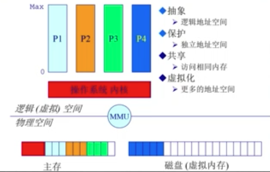
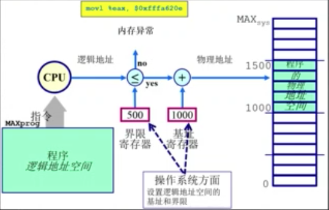

# 内存

## 计算机体系结构 / 内存分层体系

- 计算机体系结构
    - CPU 包括运算器、控制器、寄存器、缓存cache、存储管理单元MMU
    - 内存 物理内存
    - 设备（I/O）磁盘，网卡等
    - 通过总线连接
- 内存
    - 
    - 
    - 内存管理的目的
        - 抽象 逻辑地址空间
        - 保护 独立地址空间
        - 共享 访问相同内存
        - 虚拟化 更多的地址空间
    - 内存管理方法
        - 程序重定位
        - 分段
        - 分页
        - 虚拟内存
        - 按需分页虚拟内存
    - 实现高度依赖于硬件
        - 内存架构
        - MMU（内存管理单元）：硬件组件负责处理CPU的内存访问请求

- 地址空间/地址生成
    - 地址空间定义
        - 物理地址空间 - 硬件支持的地址空间
            - 起始地址 0 到 **MAX**__sys__
        - 逻辑地址空间 - 一个运行的程序所拥有的内存范围
            - 起始地址 0 到 **MAX**__prog__
        - 
        - 
    - 地址生成
        - 
        - CPU方面
            1. 运算器需要在逻辑地址的内存中的内容
            2. 内存管理单元寻找在逻辑地址空间和物理地址空间的映射关系
            3. 控制器从总线发送在物理地址的内存内容的请求
        - 内存方面
            4. 内存发送物理地址内存的内容给CPU
        - 操作系统方面
            - 建立逻辑地址和物理地址之间的映射
        - 
    - 地址安全检查（保护） 
        - CPU只知道程序要访问的逻辑地址空间
        - 操作系统设定逻辑地址空间的界限，该界限对应的物理地址空间是可以访问的
        - 
- 连续内存分配

- 在操作系统的内存管理

## 地址空间 & 地址生成

## 连续内存分配

