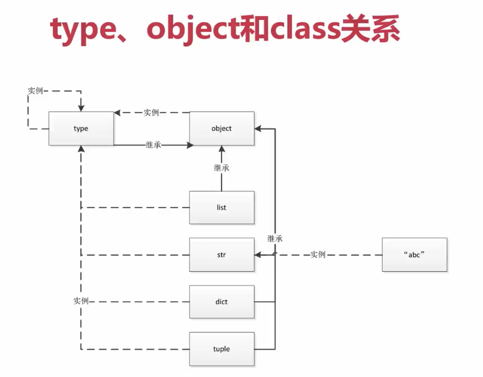
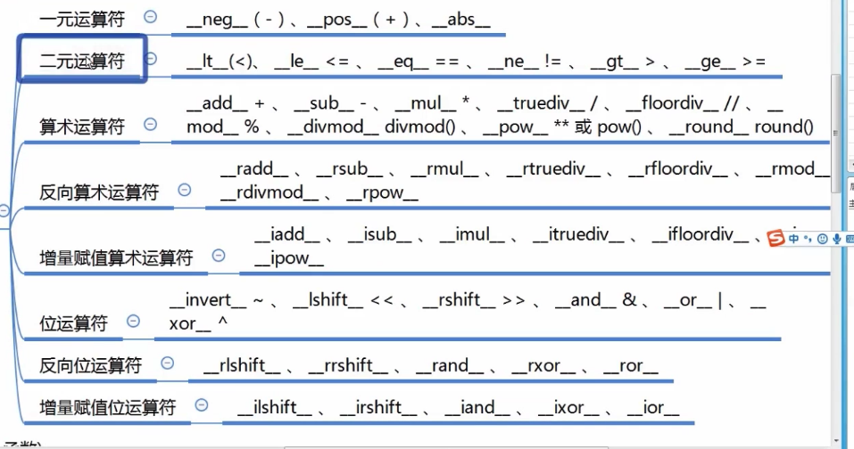

# Python 中一切皆是对象

- 一切皆是对象
  - 动态语言和静态语言的区别：python的面向对象更加彻底
  - **函数和类也是对象，属于python的一等公民**
    - **赋值给一个变量**
    - **可以添加到集合对象中**
    - **可以作为参数传递给函数**
    - **可以当做函数的返回值**
- type/object/class的关系
  - type -> class -> obj
  - 所有类继承自object

```python
# python shell >>>
a = 1
type(a)
type(int)

class A:
  pass
a = A()
type(a)
type(A)
A.__base__

int.__bases__
object.__bases__
type(object)
```



- python中常见内置类型

  - 对象的三个特征

    - 身份 id()
    - 类型
    - 值

  - None 全局只有一个

  - 数值 int/float/complex/bool

  - 迭代类型 

  - 序列类型 list/tuple/str/array/range/bytes bytearray memoryview(二级制序列)

  - 映射 dict

  - 集合 set/frozenset

  - 上下文管理类型 with

  - 其他 实现一些特定协议的对象就成为一种特殊类型

    - 模块类型
    - class 和 实例
    - 函数类型
    - 方法类型
    - 代码类型
    - object对象
    - type类型
    - ellipsis类型 ...
    - notimplemented类型

    

# 魔法方法

- 什么是魔法方法

```python
# for 循环调用__getitem__方法
class A:
    def __init__(self, a):
        self.a = a

    def __getitem__(self, item):
        print('item')
        return self.a[item]

a = A([1, 2, 3, 4, 6])

for i in a:
    print(i)

# __setitem__
class Foo(object):
    def __init__(self):
        self.name = "boo"
    def __getitem__(self, item):
        print("调用__getitem__方法了")
        if item in self.__dict__:
            return self.__dict__[item]
    def __setitem__(self, key, value):
        print("调用__setitem__方法了")
        self.__dict__[key] = value
    def __delitem__(self, key):
        print("调用__delitem__方法了")
        del self.__dict__[key]

f = Foo()
ret = f['name']
f['mmm'] = print
del f['mmm']
print(ret)
```


- python的数据模型以及数据模型对python的影响

  - 魔法函数可以用于支持一些python语法或函数

- 魔法函数一览

  - 非数学运算

    - 字符串表示 `__repr__,__str__`
    - 集合序列相关 `__len__,__getitem__,__setitem__,__delitem__,__contains__`
    - 迭代相关 `__iter__, __next__`
    - 可调用 `__call__`
    - With 上下文管理器 `__enter__, __exit__`
    - 数值转换 `__abs__, __bool__, __int__, __float__, __hash__, __index__, `
    - 元类相关 `__new__, __init__,`
    - 属性相关 `__getattr__, __setattr__, __getattribute__, __setattribute__, __dir__`

    - 属性描述符 `__get__, __set__, __delete__`
    - 协程 `__await__, __aiter__, __anext__, __aenter__, __aexit__`

  - 数学运算
```python
# 一元运算符
__neg__ -, __pos__ +, __abs__ abs()
# 二元运算符
__lt__ <, __le__ <=, __eq__ == , __ne__ !=, __gt__ >, __ge__ >=
# 算数运算符
__add__ +, __sub__ -, __mul__ *, __truediv__ /, __floordiv__ //, __mod__ %, __divmod__ divmod(), __pow__ ** pow(), __round__ round()
# 反向算数运算符
# 增量赋值算数运算符
# 位运算符
# 反向位运算符
# 增量赋值运算符
```



- len()
    - python 默认类型取len效率高，长度维护好了的

# 深入类和对象

- 鸭子类型和多态
    - 鸭子类型在[程序设计](https://wiki.hk.wjbk.site/baike-程序设计)中是[动态类型](https://wiki.hk.wjbk.site/baike-類型系統)的一种风格。在这种风格中，一个对象有效的语义，不是由继承自特定的类或实现特定的接口，而是由"当前[方法](https://wiki.hk.wjbk.site/baike-方法_(電腦科學))和属性的集合"决定。
    - 当看到一只鸟走起来像鸭子、游泳起来像鸭子、叫起来也像鸭子，那么这只鸟就可以被称为鸭子
    - [https://wiki.hk.wjbk.site/wiki/%E9%B8%AD%E5%AD%90%E7%B1%BB%E5%9E%8B](https://wiki.hk.wjbk.site/wiki/鸭子类型)
    - 不同类实现了相同的方法，就可以当做一种类型处理。
    - python的多态，鸭子类型在不使用继承的情况下使用了多态
    - 鸭子类型不是一种类型，与其对应的其他类型系统，结构类型系统，接口，模板或泛型


- 抽象基类abc模块，不能实例化，像接口
    - 继承抽象基类，必须实现指定方法
    - 可以做类型检查isinstance(a, AbsType)

```python
# 一个简单的抽象基类 调用时才能抛出异常
class AbsClass():
  	def get(self):
    		raise NotImplementedError

# 初始化时就抛出异常
import abc
class AbsClass(metaclass=abc.ABCMeta):
    @abc.abstractmethod
    def get(self):
        pass
```


- 使用isinstance而不是type
- 类变量和对象变量
- 类属性和实例属性以及查找顺序
- 静态方法，类方法和对象方法以及参数
    - 静态方法 不会将调用者传到方法里，将方法的命名空间放到类里
    - 类方法，cls 将类对象传进方法的第一个位置
- 数据封装和私有属性

- Python 对象的自省机制
    - 通过一定的机制查询到对象的内部结构

```python
# 使用.__dict__/dir()获取属性 dir比较强大，但是只能获取属性名称，不能获取值
# 类比实例有更多的内容
class User:
  	def __init__(self):
      	self.name = "abc"
        
User.__dict__
u = User()
u.__dict__
dir(u)
l = [1]
dir(l)
l.__dict__ # 异常
```

- super函数
    - 调用父类的方法
    - mro继承顺序
- drf中对多继承使用的经验 mixin
- with语句
    - 实现魔法方法 
- contextlib实现上下文管理器


# 自定义序列类

- 序列类型的分类
    - 容器序列（嵌套） list、tuple、duque
    - 扁平序列 str、bytes、bytearray、array.array
    - 可变序列 list、deque、bytearray、array
    - 不可变序列 str、tuple、bytes
- 序列的abc继承关系
- 序列的+ += extend的区别
- 实现可切片的对象
- bisect管理可排序序列
- 什么时候不应该使用列表
- 列表推导式，生成器表达式，字典推导式


# 元类编程

- Property 动态属性
    - 计算属性 @property装饰器
    - @p.setter装饰器，赋值

- `__getattr__,  __getattribute__`魔法函数
    - getattr 在查找不到属性的时候调用
    - getattribute 更底层，取属性默认调用
- 属性描述符和属性查找过程
    - 属性描述符，实现 `__get__ / __set__ / __delete__` 方法
    - 数据描述符 get和set
    - 非数据描述符 只有get
    - **属性查找过程** user.age  == getattr(user, "age")
        1. 首先调用getattribute，描述符发送在getattribute内
            1. 如果是age出现在User或基类的\_\_dict\_\_中，且age是data descriptor，那么调用数据描述符的get方法
            2. 如果age出现在user对象的\_\_dict\_\_中，那么直接返回obj.\_\_dict\_\_["age"]
            3. 如果是age出现在User或基类的\_\_dict\_\_中
                1. 如果age是non-data descriptor 那么调用get方法
                2. 否则返回User.\_\_dict\_\_["age"]
        2. 如果定义了getattr方法，在getattribute方法抛出AttirbuteError异常后调用getattr方法，
        3. 如果也没有getattr方法，抛出AttributeError异常
    - tip: 如果定义了数据描述符，但是通过user.\_\_dict\_\_["age"] = 30 赋值，这是调用数据描述符的get方法无法获取到值，会抛出AttributeError异常

```python
import numbers

# 数据描述符
class IntFiled:
    def __get__(self, instance, owner):
        try:
            return self.value
        except AttributeError as e:
            return instance.__dict__
        pass

    def __set__(self, instance, value):
        if not isinstance(value, numbers.Integral):
            raise ValueError("value is not int")
        self.value = value

    def __delete__(self, instance):
        pass

# 非数据描述符
class NonIntField:
    def __get__(self, instance, owner):
        return "non"


class User:
    age = NonIntField()
    i = IntFiled()

    def __getattribute__(self, item):
        print(item)
        raise AttributeError

    def __getattr__(self, item):
        return 44


if __name__ == '__main__':
    u = User()
    u.age = 109
    # u.__dict__["age"] = 30
    u.i = 23
    print(u.age)
    print(getattr(u, "i"))

```


- `__new__, __init__`
    - New 是类方法 控制对象生成过程，在生成对象之前
    - init 实例方法，用来完善对象
    - 如果new不返会对象，init不执行。 `retrun super().__new__(cls)`
- 自定义元类, 创建类的类(type类)
    - 类实例化过程：首先寻找mateclass，通过mateclass创建类，继承使用基类mateclass
    - 没有指定mateclass默认使用type创建类
    - 给一个类指定元类后就可以在元类中定义new方法控制类的实例化，在自己内部不需要重写new方法
- 元类实现简单的orm

```python
# 数据描述符
class Field:
    def __init__(self, column=None):
        self._value = None
        self.column = column

    def __get__(self, instance, owner):
        return self._value


class CharField(Field):
    def __init__(self, column=None, max_len=None):
        self.max_len = max_len
        super(CharField, self).__init__(column)

    def __set__(self, instance, value):
        if not isinstance(value, str):
            raise ValueError("Not str")
        self._value = value


class IntField(Field):
    def __set__(self, instance, value):
        if not isinstance(value, int):
            raise ValueError("Not int")
        self._value = value


# Model
class ModelMeta(type):
    def __new__(cls, name, bases, attrs, **kwargs):
        # type(name, bases, attrs_dict) -> a new type
        if name == "BaseModel":
            return super().__new__(cls, name, bases, attrs, **kwargs)
        attrs["fields"] = {}
        attrs["_meta"] = {}
        for k, v in attrs.items():
            if isinstance(v, Field):
                attrs["fields"][k] = v
        attr_meta = attrs.get("Meta")
        if hasattr(attr_meta, "db_table"):
            attrs["_meta"]["db_table"] = attr_meta.db_table
        else:
            attrs["_meta"]["db_table"] = name.lower()
        del attrs["Meta"]
        return super().__new__(cls, name, bases, attrs, **kwargs)


class BaseModel(metaclass=ModelMeta):
    def __init__(self, *args, **kwargs):
        for k, v in kwargs.items():
            setattr(self, k, v)
        super().__init__()

    def save(self):
        fields = [k for k, v in self.fields.items()]
        values = [v._value for k, v in self.fields.items()]
        print("sql save:", self._meta["db_table"], fields, values)


class User(BaseModel):
    name = CharField(column="name", max_len=100)
    age = IntField(column="age")

    class Meta:
        db_table = "users"


if __name__ == '__main__':
    u = User(name="xiaohei", age=12)
    u.save()

```


# Socket编程(基础)

- HTTP，Socket，TCP的概念
- socket和server实现通信
- socket实现聊天和多用户连接

```python
import socket
import threading

# 服务端代码
server = socket.socket(socket.AF_INET, socket.SOCK_STREAM)
server.bind("localhost", 9090)
server.listen()


def handle_sock(sock, addr):
    data = sock.recv(1024)
    print(data.decode("utf8"))
    sock.send(bytes(data, "utf8"))


while True:
    sock, addr = server.accept()
    new_thread = threading.Thread(target=handle_sock, args=(sock, addr))
    new_thread.start()

# 客户端代码
client = socket.socket(socket.AF_INET, socket.SOCK_STREAM)
client.connect(("localhost", 9090))
while True:
    ipt = input()
    client.send(bytes(ipt, "utf8"))
    data = client.rect(1024)
    print(data.decode("utf8"))

```


- socket模拟http请求

```python
import socket

from urllib.parse import urlparse

def get_url(url):
    url = urlparse(url)
    host = url.netloc
    path = url.path
    if path == "":
        path = "/"
    client = socket.socket(socket.AF_INET, socket.SOCK_STREAM)
    client.connect((host, 80))

    client.send("GET {} HTTP/1.1\r\nHost:{}\r\nConnection:close\r\n\r\n".format(path, host).encode("utf8"))

    data = b""
    while True:
        d = client.recv(1024)
        if d:
            data += d
        else:
            break

    data = data.decode("utf-8").split("\r\n\r\n")[1]
    print(data)
    client.close()


if __name__ == '__main__':
    get_url("http://www.baidu.com")
```


# 多线程 多进程

- GIL (global interpreter lock) 全局解释器锁 cpython （pypy去gil）
    - 同一时刻只有一个线程运行在一个cpu上执行字节码，无法将多个线程放到多个cpu上运行
    - 执行一个线程的字节码一定数量或时间释放，使其他线程可以运行
    - IO操作释放，sleep释放
    
- 多线程

    - Thread
    - 主线程退出后子线程也被销毁 可使用setDaemon设置为守护线程
    - 主线程等待子线程完成 thread.join()，阻塞等待

    

- 线程通信 Queue

- 线程同步 Lock、RLock、semaphores、Condition

- consurrent线程池编码

- 多进程编程 multiprocessing

- 进程通信


